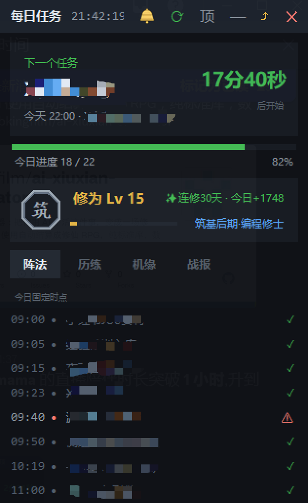
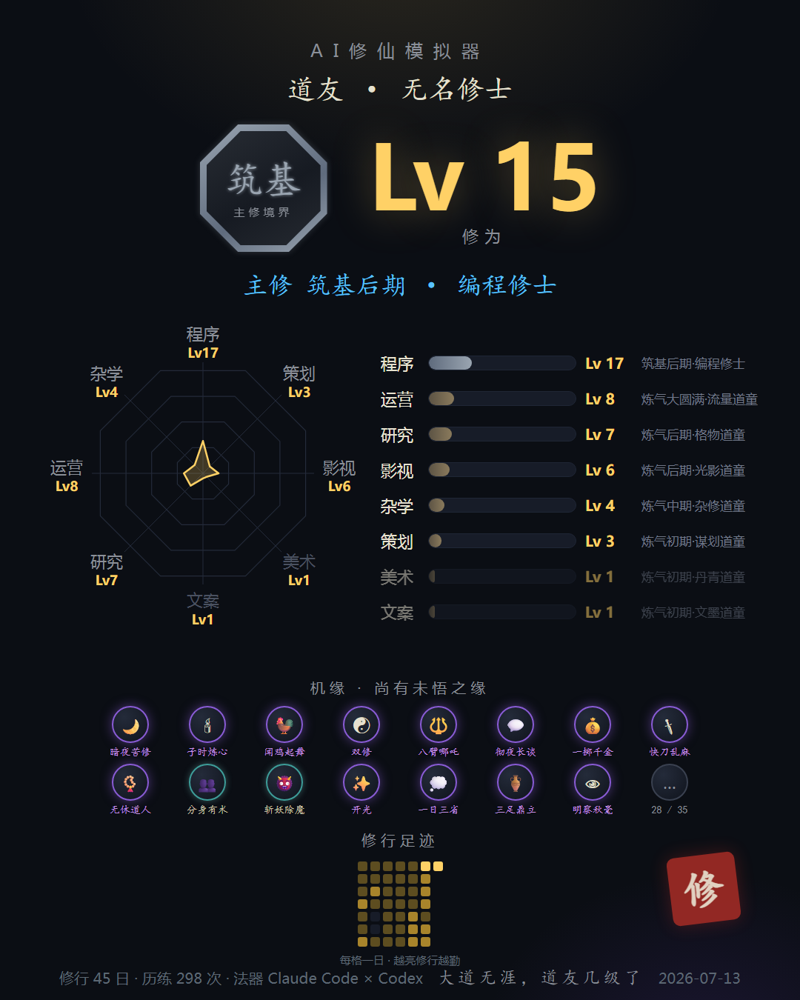
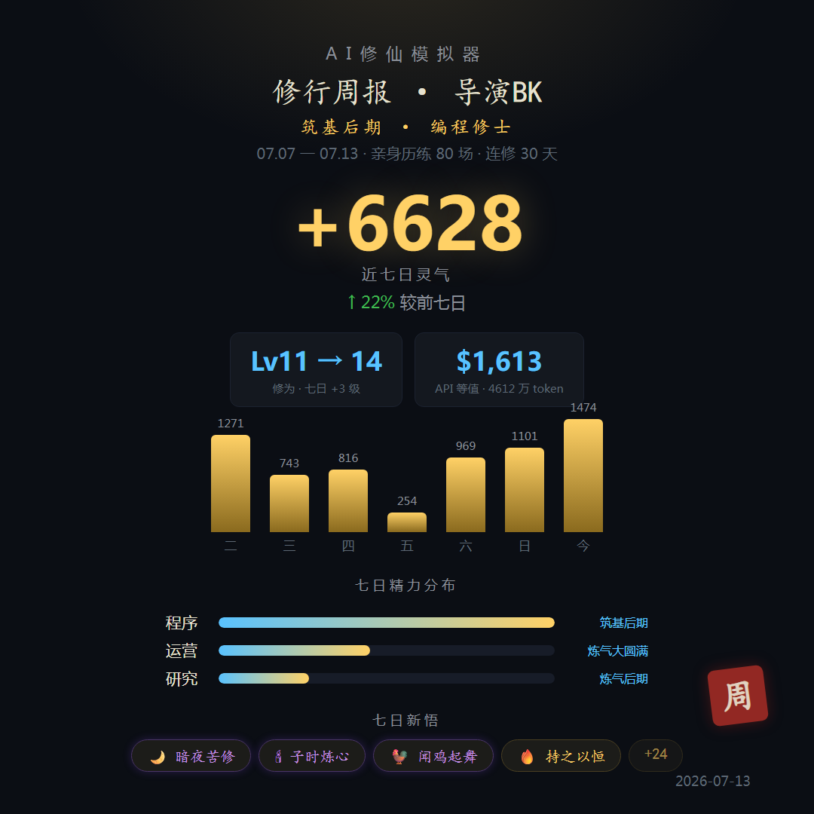
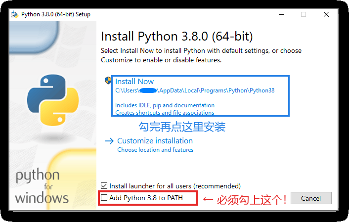

# AI修仙模拟器

把你用 AI 干活这件事，变成一场修仙。

你平时怎么用 AI 就怎么用，什么都不用改。系统在后台自动记账：每个真实任务折算成灵气，攒修为、升境界、悟机缘。

炼气 → 筑基 → 金丹 → 元婴 → 化神 → 炼虚 → 合体 → 大乘 → 渡劫 → 飞升。

主界面是一张常驻桌面的任务贴纸：修为境界实时看，AI 任务跑没跑完一眼清。

  

## 特性

- **桌面贴纸主界面**：修仙状态栏 + 四页切换。历练页实时显示今天每个 AI 会话的状态（⏸ 等你确认 / ◐ 运行中 / ✓ 已完成），任务跑完了不用再回去翻窗口
- **零侵入**：只读你本机 AI 工具的会话记录，不改变任何使用习惯
- **多工具叠加**：Claude Code 与 Codex 自动识别，经验直接叠加，新工具写一个适配器就能接入
- **实时结算**：Claude Code 用户每次会话结束秒级结算，境界突破、新悟机缘当场弹窗，长任务完成敲一声木鱼
- **八道境界**：程序 / 策划 / 影视 / 美术 / 文案 / 研究 / 运营 / 杂学，各自独立修行
- **等级卡与周报**：一键生成修仙风分享卡和七日修行周报，含 API 等值美金账单，直接发群里比
- **纯标准库**：除 Python 外零依赖，所有数据只在你自己电脑上算，不上传任何东西

  
  

## 需要什么

- Windows 10/11
- Python 3.8+（python.org 下载，安装时勾选 Add to PATH）
- 你在用 **Claude Code** 或 **Codex**（CLI/Desktop）

## 安装

去 [Releases](https://github.com/bkingfilm/ai-xiuxian-simulator/releases) 下载最新 zip，解压到任意目录（路径别再挪，挪了重跑一次安装）。

**Windows**

1. 双击 `①双击我安装.bat`
2. 没装过 Python 的会自动打开下载页，点黄色的 Download Python 按钮下载
3. 打开下载的安装包，**先勾选底部的 Add Python to PATH，再点 Install Now**（照下图做）
4. 装完重新双击 `①双击我安装.bat`

**macOS**

1. 双击 `①双击我安装.command`（如提示无法打开：右键 → 打开）
2. 首次可能提示安装开发者工具，照提示装完重跑

弹出的窗口里取个道号，点「开始修行」。你的全部历史使用会立刻结算成等级，用得久的人开局就不是道童，装完桌面贴纸自动弹出。

## 怎么玩

主界面就是那张桌面贴纸，拖顶栏挪位置，✕ 关掉当天不再自动弹（想再看随时双击 `①双击我安装.bat` 打开）。

- **修仙状态栏**：修为等级 + 今日灵气 + 连修天数 + 主修称号，点八边形徽章直接出等级卡
- **历练页**：今天亲手派的每个 AI 会话实时状态，⏸ 等你确认 / ◐ 运行中 / ✓ 已完成
- **阵法页**：你的定时任务时点表和执役核对（可选功能，配了护法时刻表才有）
- **机缘页**：已悟机缘图鉴，未悟的只给剪影，条件自行参悟
- **战报页**：今日修行小结，看面板 / 出周报 / 重新结算按钮也在这页
- **等级卡**：贴纸右上 ⤴ 一键生成到桌面，或双击 `出等级卡.bat`（Mac：`.command`）
- **网页面板**：桌面「AI修仙模拟器.html」，看八道境界全景和修行足迹热力图

## 规则

不公开。做什么涨得快、机缘怎么解锁，自己悟，或者跟其他道友交流。
只说三件事：

1. 灵气只来自真实使用，没有任何行为可以刷
2. 挂机跑的自动任务，灵气稀薄
3. 境界越往后越难，99 级飞升是以年计的事

（是的，源码就在这里。翻源码等于看攻略本，选择权在你。）

## 高级玩法：护法（自动任务监督，可选）

如果你也让 AI 跑定时任务（内容引擎、数据采集之类），可以让本系统当监督总管：
复制 `watchdog-tasks.example.json` 为 `watchdog-tasks.json`，照自己的任务改写时刻表，
护法每小时核对所有任务是否运转，谁没跑弹红色警报「护法示警：阵法停转」。
不建这个文件，此功能自动关闭，不影响其他一切。

## 隐私

所有数据只在你自己电脑上算，不上传任何东西。
等级卡上只有等级、境界、机缘名，不会出现你干了什么任务的任何内容，放心晒。

## 卸载

删掉目录，再删掉计划任务「AI修仙-数据源轮询」（任务计划程序里删除）。
Claude Code 用户另在 `~/.claude/settings.json` 里删掉含 settle.py 的 hook。

## 反馈

开 Issue 直接说：哪里不好玩、哪里看不懂、想比什么。
